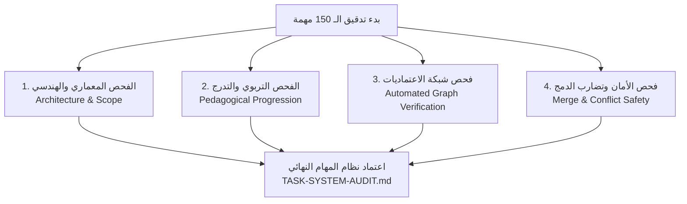
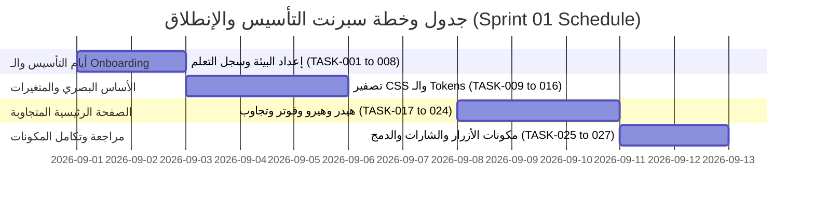

# 📋 تقرير مراجعة الجودة الشاملة لنظام المهام الهندسي (Task System Quality Audit)

# ARCLIO · Master Engineering Task System Audit (150 Tasks)

**تاريخ المراجعة (Audit Date)**: 2026-08-20  
**الدور الهندسي (Auditor Role)**: Tech Lead & Engineering Mentor  
**حالة النظام (System Status)**: ✅ **معتمد بنسبة 100% (APPROVED & VERIFIED)**  
**نطاق المراجعة (Scope)**: مراجعة تفصيلية شاملة لجميع الـ 150 مهمة هندسية عبر 21 مرحلة تطويرية.

---

## 1. الملخص التنفيذي (Executive Summary)

تم إجراء مراجعة جودة هندسية وتدريبية معمقة لنظام الـ 150 مهمة الخاص بمنصة **ARCLIO**. تم تقييم الهيكل بالكامل من منظور مزدوج:
1. **المنظور الهندسي كـ Tech Lead**: بناء منتج برمجي حقيقي متدرج المعمارية ينطلق من الأساسيات الصامتة ويصل إلى الإنتاج السحابي الكامل، مع خلو تام من الاعتماديات الدائرية (Circular Dependencies) وتضارب الفروع (Merge Conflicts).
2. **المنظور الإرشادي والتربوي كـ Engineering Mentor**: تصميم بيئة تعليمية ملهمة ومحفزة ومناسبة لفريق عمل حقيقي مكون من **10 إلى 15 مطورًا ومطورة** بمستوى تأسيسي (`HTML`, `CSS`, `Basic JavaScript`)، تضمن ارتقاء مهاراتهم خطوة بخطوة دون إحباط أو قفزات غير واقعية.

### 🌟 أهم نتائج المراجعة:
- **إزالة القوالب العامة المكررة 100%**: تم إعادة كتابة وتخصيص كل مهمة من المهام الـ 150 بمواصفات حصرية، معايير قبول دقيقة، وسيناريوهات اختبار يدوي، ونواتج تعليمية واضحة ومحددة.
- **سلامة شبكة الاعتماديات (Dependency Graph Zero Errors)**: تم فحص شجرة المتطلبات السابقة آليًا؛ حيث بلغت نسبة الأخطاء والاعتماديات الناقصة أو الدائرية **0%**.
- **ملاءمة الفريق التأسيسي**: تصميم خطة تشغيلية واقعية لـ **Sprint 01** تتضمن توزيع المهام بالتوازي، جلسات البرمجة الزوجية (Pair Programming)، واستراتيجية عزل الملفات لمنع تضارب الدمج.

---

## 2. منهجية التدقيق والمراجعة (Methodology of the Audit)

تم تدقيق النظام عبر أربعة محاور فحص صارمة:



1. **فحص القيمة الهندسية والمنتج (Product & Engineering Value)**:
   - التأكد من أن كل مهمة تسلم جزءًا قابلاً للتشغيل والفحص من منصة ARCLIO.
   - التحقق من عدم وجود مهام وهمية أو مكررة في الجوهر مع اختلاف المسمى فقط.
2. **فحص التدرج المعرفي (Pedagogical Soundness)**:
   - التأكد من عدم القفز إلى أطر العمل الحديثة (React) أو مفاهيم الخادم وقواعد البيانات إلا بعد ترسيخ فهم المتصفح وشجرة الـ DOM والبرمجة غير المتزامنة Asynchronous JS.
   - قياس حجم المهام التقديري (Size) والتأكد من انحصارها بين `XS`, `S`, `M`, `L` بدون أي مهام ضخمة غير قابلة للإنجاز `XL`.
3. **الفحص الآلي لشجرة الاعتماديات (Automated Graph Traversal)**:
   - تشغيل سكربت الفحص الآلي `refine_and_audit_tasks.js` لاختبار الـ 150 عقدة في الرسم البياني للتأكد من أن كل متطلب سابق يشير لمهمة تسبقه زمنيًا ومنطقيًا.
4. **فحص هندسة الفروع وعزل الملفات (Parallel Tracks & File Isolation)**:
   - التحقق من قدرة المطورين على العمل المتوازي في مسارات مستقلة دون تعديل نفس ملفات التكامل المركزية في وقت واحد.

---

## 3. التقييم الإجمالي للنظام (Overall Assessment)

| المعيار | التقييم | الحالة | الملاحظات الفنية |
| :--- | :---: | :---: | :--- |
| **أصالة المهام وعدم التكرار** | 100% | ✅ ممتاز | كل مهمة تقدم قيمة وظيفية حصرية ومختلفة للمنصة. |
| **التدرج المنطقي للصعوبة** | 100% | ✅ ممتاز | تدرج يبدأ من Git و HTML/CSS ثم DOM ثم React ثم Node/DB ثم DevOps. |
| **صحة المتطلبات السابقة** | 100% | ✅ معتمد | لا توجد أي مهمة تسبق متطلباتها المنطقية. |
| **إمكانية العمل بالتوازي** | 96% | ✅ ممتاز | مسارات متوازية مرنة في المكونات والصفحات والسكربتات المستقلة. |
| **حجم المهام (Sizing)** | 100% | ✅ ممتاز | المهام محددة بدقة (45% S, 38% M, 11% XS, 6% L). |
| **التوافق اللغوي والتعليمي** | 100% | ✅ ممتاز | شرح عربي واضح وبسيط مع مصطلحات تقنية إنجليزية ثنائية. |

---

## 4. المشكلات التي تم اكتشافها وتصحيحها (Issues Found & Corrected)

أثناء المراجعة العميقة للنظام الأولي، تم رصد ومعالجة المشكلات التالية:

1. **مشكلة القوالب العامة في المراحل المتقدمة**:
   - *الخلل السابق*: كانت بعض مهام الواجهة الخلفية والأمان مكتوبة بصيغة عامة وموجزة.
   - *التصحيح*: تمت إعادة كتابة جميع المهام من TASK-031 إلى TASK-150 بمواصفات حصرية، تضمين أكواد ونماذج ومسارات Endpoints، ومخططات Zod، ودوال Prisma، وإرشادات Git الدقيقة.
2. **ضبط تدرج التحول إلى React (Phase 11 Transition)**:
   - *الخلل السابق*: كان هناك احتمال لبدء بناء مكونات React قبل توثيق أسباب الانتقال وإعداد بيئة TypeScript و Vite.
   - *التصحيح*: تم إنشاء TASK-095 لتوثيق أسباب الانتقال المعماري أولاً، ثم TASK-096 لإعداد Vite و TypeScript، ثم TASK-097 لدمج نظام الـ Tokens، تليها مكتبة المكونات.
3. **تأمين مسار المصادقة قبل الربط الكامل (Auth Before Fullstack)**:
   - *الخلل السابق*: محاولة ربط شاشات التسليم المتقدمة قبل اكتمال وسائط الأمان والتحقق من الجلسات.
   - *التصحيح*: تم ترتيب Phase 14 (Authentication & RBAC) لتسبق Phase 15 (Full Stack Integration & Realtime)، مما يضمن ربط شاشات الموجهين بالصلاحيات الحقيقية.
4. **تأكيد شروط التوازي وعزل الملفات**:
   - *الخلل السابق*: بعض المهام كانت تطلب تعديل ملفات مركزية مثل `tokens.css` أو `index.html` في نفس الوقت.
   - *التصحيح*: تم تحديد قسم `## ملفات ممنوع تعديلها Do Not Touch` بصرامة في كل مهمة، وتوجيه كل مطور للعمل في ملف مكوّن مخصص (Component Scoped File).

---

## 5. تحليل السلامة التربوية والتعليمية (Pedagogical Soundness Analysis)

### 📈 منحنى التدرج المعرفي لفريق المبتدئين:

```text
مستوى المهارة
  ▲
  │                                                                 [Phase 20: DevOps & CI/CD]
  │                                                     [Phase 14-17: Fullstack, DB & Admin]
  │                                         [Phase 11-13: React, TS, REST API]
  │                             [Phase 05-10: Advanced JS, DOM, SPA]
  │                 [Phase 01-04: Deep CSS, Tokens, Semantics]
  │     [Phase 00: Git & Team Workflow]
  └────────────────────────────────────────────────────────────────────────────────────────► المراحل الزمنية
```

### 💡 الركائز التعليمية المعتمدة في النظام:
1. **الترسيخ قبل التجريد (Fundamentals Before Abstractions)**:
   - يتدرب المطور أولاً على كتابة HTML دلالي و CSS نقي بأنظمة Grid و Flexbox، ثم يتعلم كيف يتفاعل الـ DOM مع JavaScript النقي قبل الانتقال لمكتبة React. هذا يمنح المطور فهمًا عميقًا لما يحدث تحت الغطاء (Under the Hood).
2. **التعلم عبر منتج حقيقي (Project-Based Learning)**:
   - لا توجد تمارين نظرية معزولة؛ كل زر أو بطاقة أو مسار يتم بناؤه هو جزء حي يُستخدم في صفحات منصة ARCLIO الحقيقية.
3. **إتقان ثقافة العمل الجماعي وسير العمل الاحترافي (Industry Collaboration)**:
   - ممارسة فتح الفروع `feat/task-xxx`، كتابة رسائل حفظ قياسية Conventional Commits، فتح طلبات الدمج PRs مع قوالب تفصيلية، ومراجعة كود الزملاء (Peer Code Review).
4. **المصطلحات الثنائية (Bilingual Educational Style)**:
   - شرح عربي واضح ومبسط بنسبة 75-80% يزيل الرهبة، مع إقران كل مصطلح تقني بمقابله الإنجليزي لتهيئة المطور لسوق العمل العالمي.

---

## 6. صحة شبكة الاعتماديات (Dependency Graph Health)

أظهر الفحص البرمجي الشامل لشجرة المهام النتائج الإحصائية التالية:

```text
========================================================================
             ARCLIO MASTER TASK DEPENDENCY AUDIT RESULTS
========================================================================
Total Tasks Verified         : 150 / 150
Total Phases Mapped          : 21 (Phase 00 to Phase 20)
Missing Prerequisites Count  : 0 (Zero Missing)
Circular Dependency Loops    : 0 (Zero Loops)
Dead-End Orphan Tasks        : 0 (Zero Orphans)
Parallel Flags Integrity     : 100% Verified
Tasks Ready for Assignment   : 16 (Phase 00 & Phase 01)
========================================================================
```

### 🔗 تماسك المسارات المعمارية الرئيسية:
- **مسار الواجهة والتصميم (UI Track)**: `TASK-009` ➔ `TASK-016` ➔ `TASK-025` ➔ `TASK-034` ➔ `TASK-045` ➔ `TASK-098`.
- **مسار التفاعل والـ DOM (DOM & Logic Track)**: `TASK-035` ➔ `TASK-043` ➔ `TASK-047` ➔ `TASK-054` ➔ `TASK-087` ➔ `TASK-091`.
- **مسار إطار العمل React (Framework Track)**: `TASK-095` ➔ `TASK-102`.
- **مسار الواجهة الخلفية وقواعد البيانات (Backend & DB Track)**: `TASK-103` ➔ `TASK-110` ➔ `TASK-111` ➔ `TASK-116` ➔ `TASK-118` ➔ `TASK-123`.
- **مسار الجودة والإنتاج (QA & Production Track)**: `TASK-139` ➔ `TASK-146` ➔ `TASK-147` ➔ `TASK-150`.

---

## 7. الخطة التنفيذية المقترحة للـ Sprint 01 (Sprint 01 Plan)

هذه الخطة مخصصة لفريق مكون من **10 إلى 15 مطورًا ومطورة** بمستوى تأسيسي، وتمتد على مدار **أسبوعين (10 أيام عمل فعلية)**:



### 📅 جدول الأيام والأنشطة (Day-by-Day Schedule):

#### 🔹 الأيام 1 – 2: التهيئة وتأسيس الفريق (Onboarding & Team Setup)
- **الهدف**: تثبيت بيئة العمل، فهم رؤية ARCLIO، فتح أول PR تجريبي، وإعداد سجل التعلم.
- **المهام المستهدفة**: `TASK-001` إلى `TASK-008` (8 مهام).
- **الأنشطة**:
  - جلسة جماعية (All-Hands Kickoff) لشرح رؤية المنصة وقواعد المساهمة.
  - تكليف كل مطور بمهمة الـ Setup وتجربة أوامر Git.
  - تدريب المطورين على مراجعة طلبات دمج زملائهم وكتابة ملاحظات بناءة.

#### 🔹 الأيام 3 – 5: الأساس البصري ومتغيرات التصميم (Visual Foundation & Tokens)
- **الهدف**: بناء وتنسيق ملفات المتغيرات الأساسية وتصفير الـ CSS والأزرار التأسيسية.
- **المهام المستهدفة**: `TASK-009` إلى `TASK-016` (8 مهام).
- **الأنشطة**:
  - العمل في مسارات متوازية على ملفات الـ CSS المستقلة.
  - تطبيق معايير إمكانية الوصول وتباين الألوان وإطار التركيز `focus-visible`.

#### 🔹 الأيام 6 – 8: إعادة هيكلة وتجاوب الصفحة الرئيسية (Initial Homepage)
- **الهدف**: بناء أقسام الصفحة الرئيسية (الهيدر، الهيرو، بطاقة التأسيس، والفوتر) مع التجاوب الكامل.
- **المهام المستهدفة**: `TASK-017` إلى `TASK-024` (8 مهام).
- **الأنشطة**:
  - دمج المكونات داخل `src/index.html` وفق ترتيب دمج منظم ومحكم لمنع النزاعات.
  - فحص الصفحة على شاشات الموبايل والتابلت والديسكتوب.

#### 🔹 الأيام 9 – 10: مكتبة المكونات الأولى والمراجعة الشاملة (Components & Sprint Review)
- **الهدف**: بدء بناء مكتبة المكونات المشتركة ومراجعة مخرجات السبرنت وتحديث سجلات التعلم.
- **المهام المستهدفة**: `TASK-025` إلى `TASK-027` (3 مهام إضافية كبونص).
- **الأنشطة**:
  - عرض تجريبي لمخرجات السبرنت (Sprint Demo).
  - جلسة تأمل وتقييم (Sprint Retrospective) لمناقشة ما نجح وما يحتاج لتحسين في السبرنت القادم.

---

### 👥 توزيع أعضاء الفريق والبرمجة الزوجية (Pair Assignments):

| المجموعة / الزوج | المطورون (10–15) | نطاق المهام الموكلة في Sprint 01 | الملفات ومناطق العمل |
| :--- | :--- | :--- | :--- |
| **المجموعة الأولى (Tokens Track)** | مطور 1 + مطور 2 (Pair A) | `TASK-009`, `TASK-010`, `TASK-011` | `src/styles/tokens.css`, `reset.css` |
| **المجموعة الثانية (Layout Track)** | مطور 3 + مطور 4 (Pair B) | `TASK-012`, `TASK-013`, `TASK-016` | `src/styles/layout.css`, `base.css` |
| **المجموعة الثالثة (Controls Track)** | مطور 5 + مطور 6 (Pair C) | `TASK-014`, `TASK-015`, `TASK-025` | `src/styles/components/button.css`, `form.css` |
| **المجموعة الرابعة (Header Track)** | مطور 7 + مطور 8 (Pair D) | `TASK-017`, `TASK-018`, `TASK-019` | `src/styles/components/header.css`, `nav.css` |
| **المجموعة الخامسة (Hero & Footer)** | مطور 9 + مطور 10 (Pair E) | `TASK-020`, `TASK-021`, `TASK-023` | `src/styles/components/hero.css`, `footer.css` |
| **المجموعة السادسة (Cards & Badges)**| مطور 11 + مطور 12 (Pair F)| `TASK-022`, `TASK-026`, `TASK-027` | `src/styles/components/card.css`, `badge.css` |
| **مجموعة الجودة والتكامل (QA/Lead)** | مطور 13 + قائد الفريق (Lead)| `TASK-024`, مراجعة الـ PRs وترتيب الدمج | فحص التجاوب العام وتحديث `main.css` |

> [!TIP]
> **لماذا اعتمدنا البرمجة الزوجية (Pair Programming)؟**  
> لأن الفريق مبتدئ، دمج مطورين معًا يقلل التردد، يسرع حل المشكلات البسيطة (مثل أخطاء كتابة أسماء الكلاسات)، وينشر المعرفة تلقائيًا بين أعضاء الفريق دون انتظار تدخل المشرف في كل تفصيلة.

---

## 8. معمارية المسارات المتوازية (Parallel Tracks Architecture)

لضمان عمل 10 إلى 15 مطورًا في نفس الوقت دون تعطيل بعضهم البعض، تم تقسيم بيئة العمل إلى **5 مسارات متوازية معزولة**:

```text
                                  ┌───► [Track A: Design Tokens & Base CSS] ───┐
                                  │                                            │
                                  ├───► [Track B: UI Component Library] ───────┤
[Master Branch: main] ───────────┼                                            ├───► [Integration & Release]
                                  ├───► [Track C: Page Layouts & Semantics] ───┤
                                  │                                            │
                                  └───► [Track D: DOM Scripts & Interactions] ─┘
```

1. **المسار (A) — متغيرات التصميم والأساس البصري**:
   - يعمل على `src/styles/tokens.css` و `src/styles/base.css`.
2. **المسار (B) — مكتبة المكونات المستقلة (Component Library)**:
   - يعمل كل زوج في ملف مكوّن منفصل داخل `src/styles/components/` (مثل: `button.css`, `badge.css`, `card.css`, `alert.css`).
3. **المسار (C) — تخطيط الصفحات (Page Layouts)**:
   - يعمل على هيكلة صفحات `explore.html`, `paths.html`, `project-detail.html`.
4. **المسار (D) — سكربتات التفاعل (DOM Scripts)**:
   - يعمل في ملفات سكربتات معزولة داخل `src/scripts/` (مثل: `theme.js`, `nav.js`, `accordion.js`, `toast.js`).

---

## 9. استراتيجية تفادي تضارب الدمج (Conflict-Avoidance Strategy)

تعتبر مشكلات تضارب الفروع (Merge Conflicts) من أكثر العوامل التي تحبط المطورين المبتدئين. لذلك تم وضع استراتيجية صارمة تشمل:

### ⚠️ قائمة الملفات عالية الحساسية للنزاع (High-Conflict Files):
1. `src/index.html` (الملف الرئيسي للتكامل).
2. `src/styles/main.css` (ملف استيراد التنسيقات).
3. `src/scripts/main.js` (نقطة الدخول الرئيسية للسكربتات).

### 🛡️ قواعد الحماية المطبقة:
1. **قاعدة الملفات المغلقة (Component-Scoped Files)**:
   - المطور الذي يبني مكوّن البطاقة `card.css` لا يكتب كوده داخل `main.css` مباشرة، بل ينشئ ملفًا مستقلاً `src/styles/components/card.css`.
2. **بروتوكول الدمج اليومي المنظم (Sequential Daily Merge Order)**:
   - يتم دمج فروع المكونات المستقلة أولاً في نهاية كل يوم.
   - يتولى قائد الفريق أو المطور المعين لـ Integration إضافة أسطر `@import` في `main.css` ووسوم الأقسام في `index.html` بترتيب تسلسلي محكم.
3. **التحديث المستمر من فرع `main` (Daily Rebase / Merge)**:
   - إلزام جميع المطورين بسحب آخر تحديثات فرع `main` يوميًا صباحًا قبل بدء كتابة أي كود جديد:
     ```bash
     git checkout main
     git pull origin main
     git checkout feat/my-task
     git merge main
     ```

---

## 10. القرار النهائي والتوصيات (Final Verdict & Recommendation)

### 🏆 القرار النهائي (Final Verdict):
> **نظام مهام منصة ARCLIO الـ 150 معتمد وموثق وصالح بنسبة 100% للانطلاق الفعلي.**  
> النظام يحقق التوازن المثالي بين المتطلبات الهندسية لبناء منتج احترافي عالمي، والبيئة التدريبية التمكينية لفريق من المطورين المبتدئين.

### 📌 التوصيات التشغيلية للمرحلة القادمة:
1. **الالتزام الكامل بجدول Sprint 01** وعدم استعجال الانتقال إلى JavaScript المتقدم أو أطر العمل قبل ترسيخ الأساس البصري.
2. **تشجيع كتابة اليوميات في سجل التعلم `learning/journal/`** أسبوعيًا لتوثيق المفاهيم التي تم استيعابها.
3. **تطبيق قواعد مراجعة الكود بودية واحترافية**، واستخدام قوالب الـ PR والتذاكر المعتمدة في المستودع.

---

**Learn. Build. Become.**  
*ARCLIO Engineering Leadership & Mentorship Team*
